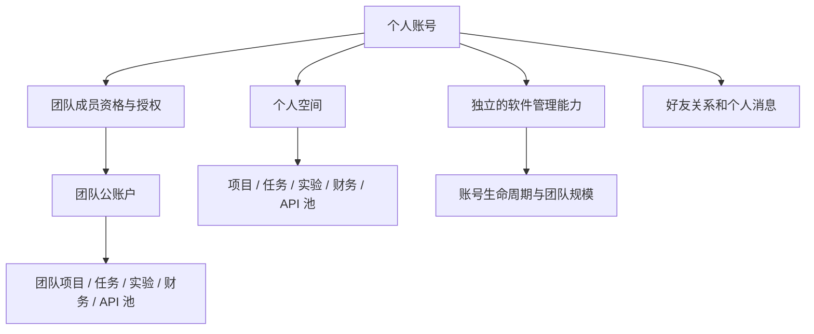

# 0.3 架构与迁移

## 数据与权限

`Workspace` 的所有者只允许二选一：个人 User 或组织 Team。业务模型统一带必填 `workspace`，`team` 为兼容镜像。请求、后台 Agent 和 Bearer API 都在明确的空间范围中工作；普通查询默认按当前空间过滤，关联记录及成员须属于同一空间。

团队所有者与管理员管理本组织；岗位能力保存在 `TeamMembership.permissions`。个人空间的所有者拥有自己的业务操作能力。旧 `admin/developer/normal` 名称只作为旧业务模块的兼容适配，不是全局账号身份。

软件身份使用独立 Django 权限 `manage_platform_accounts` 与 `manage_team_admission`。`is_staff` 不再自动授权团队业务；`is_superuser` 只负责软件所有者操作及管理身份授予，也不能直接跨空间读取私有业务。

`WorkspaceEvent` 记录个人操作者、记录所属空间、操作类型与当时的团队角色/岗位/授权快照，不复制业务正文或密钥。`PlatformAudit` 记录平台账号操作与原因。

## 会话范围

好友、好友申请、个人消息和普通好友群属于个人层；Team 群需要有效 Team 成员资格。默认团队群复用旧 `ChatMessage` 内部记录，旧私聊通过 `PersonalMessage.legacy_message` 保留源记录及其文件、引用和积分记录。

聊天的原空间由明确的 `space` 参数传入并重新验证；它不修改用户在工作台选择的空间。个人/团队引用显示原空间记录的实时权限，不把引用当作额外授权。

## 账号生命周期

个人注销保留内部 User 主键供历史记录引用，清除邮箱/公开资料、关闭个人空间和成员资格、禁用密码并撤销凭证。软件封禁只停用账号，解封不会使旧凭证恢复。团队注销是组织操作，不能用删除个人账号代替。

账号拥有活动团队或群时，须先交接或解散；团队成员资格删除不影响其他组织及个人数据。已解散组织不能通过普通的「启用团队」恢复。

## 发布与服务器迁移

当前代码来自 `codex/desktop-preview` / PR #6，尚未 Merge。此文档不授权正式部署。

验收后升级前：

1. 记录固定提交号，并保存数据库、附件、环境配置与 API 密钥备份。
2. 检查 `/etc/research-workbench.env` 中真实 SMTP 配置。0.3.1 开放验证邮箱后的个人注册，团队邀请码可选；旧的 WORKBENCH_OPEN_REGISTRATION 值不再阻止这条邮箱注册流程。
3. 按需要设置 `WORKBENCH_DEFAULT_TEAM_LIMIT=10`；已建团队继续使用自己的容量，不被默认值重写。
4. 在固定源码上运行 `deploy/upgrade_preserve_data.sh --prepare`，检查旧库迁移检查结果。它使用隔离副本，不切换正式服务。
5. 只有管理员确认后，才运行同一源码的 `--apply`。升级保留账号密码、邮箱、原团队和数据；检查健康接口、个人/团队空间与登录。

0.3 数据库结构新增必填空间字段。回退到 0.2 客户端不能回退服务端结构；如需回退服务端，请停止服务并恢复升级前匹配的源码与备份，不能覆盖仍在运行的数据库。

本地测试只用 `.test-scratch` 的临时数据库、邮件存储与隔离浏览器，不使用生产 SMTP、真实模型调用或正式业务数据。
